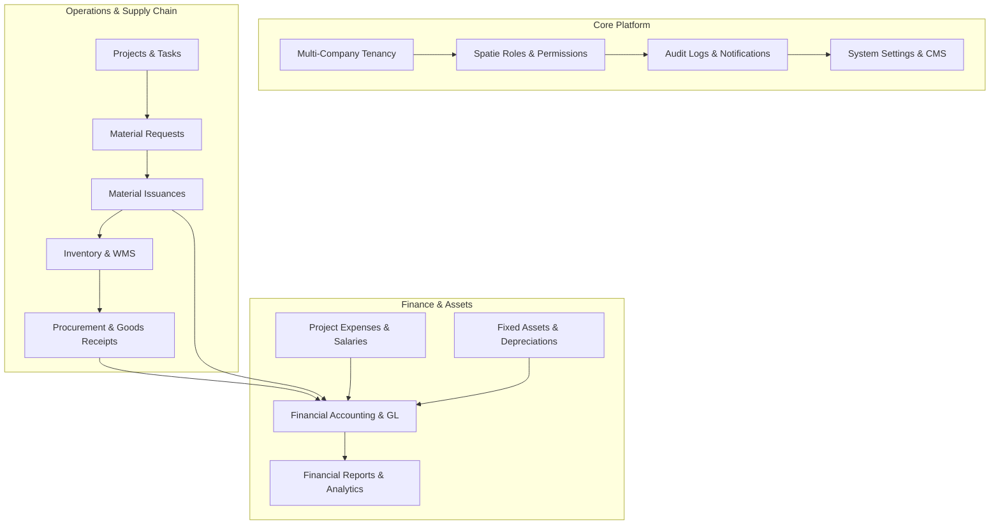

# Creative ERP Strategic Vision & Architecture

**Version**: 1.1  
**Document**: 01_PROJECT_VISION  
**Status**: Approved & Updated  
**Author**: Creative ERP Development Team  

---

# 1. Executive Summary

Creative ERP is a next-generation Enterprise Resource Planning platform designed specifically for engineering, contracting, architecture, construction, and project-based enterprises.

Unlike fragmented off-the-shelf software solutions that decouple accounting, project execution, and inventory tracking, Creative ERP integrates all core operational verticals into a unified digital workspace:

- **Project Management**: Budgets, actual costs, milestones, tasks, team roles, time tracking, discussions, and meetings.
- **Material Requests & Issuances**: Site material requests, multi-tier approvals, and direct warehouse-to-project material issuances.
- **Project Expenses & Labor/Salaries**: Expense tracking with distinction between direct project expenses and worker salaries/labor wages.
- **Procurement & Purchasing**: Requisitions, multi-vendor RFQs, purchase orders, 3-way matching, goods receipts, purchase invoices, and supplier payments.
- **Inventory & Advanced WMS**: Multi-warehouse stock control, zone/bin locations, movements, transfers, reservations, cycle counts, picking, packing, put-away, and shipments.
- **Double-Entry Financial Accounting**: Chart of accounts, general ledger, journal vouchers, fiscal years, monthly period locking, auto-posting engine, and financial statements (P&L, Balance Sheet, Cash Flow).
- **Fixed Asset Lifecycle Management**: Asset tracking, assignments, maintenance, transfers, disposals, and automated depreciation schedules with GL integration.
- **CRM & Invoicing**: Lead pipeline management (Kanban), quotations, customer invoices, payments, credit notes, refunds, and client account statements.
- **Platform Core & Governance**: Multi-company tenancy, Spatie role/permission authorization, activity logging, notifications, CMS website, and in-app documentation.

---

# 2. Vision & Mission Statements

### Vision Statement
To empower project-driven companies with a seamless, modular, and cloud-ready ERP platform that delivers absolute operational transparency, automated financial integrity, and site-to-office efficiency.

### Mission Statement
Deliver an intuitive, enterprise-grade software platform that unifies project management, supply chain, site material control, asset management, and financial accounting without operational friction.

---

# 3. System Scope & Functional Modules

The system encompasses the following core functional areas:

---

# 4. Cross-Module Integration Mapping

Creative ERP relies on total cross-module connectivity:

1. **Material Issuance Flow**:  
   `Site Engineer Requests Material` $\rightarrow$ `Approval` $\rightarrow$ `Material Issued from Warehouse` $\rightarrow$ `Warehouse Inventory Reduced` $\rightarrow$ `Project Material Cost Updated`.

2. **Procurement & Inventory Flow**:  
   `Purchase Requisition` $\rightarrow$ `RFQ & Quotation Matrix` $\rightarrow$ `Purchase Order` $\rightarrow$ `Goods Receipt (GRN)` $\rightarrow$ `Warehouse Stock Increased` $\rightarrow$ `Auto GL Post (Debit Inventory, Credit Accounts Payable)` $\rightarrow$ `Purchase Invoice & Payment`.

3. **Project Expense & Labor Flow**:  
   `Project Expense / Worker Salary Logged` $\rightarrow$ `Project Actual Cost Updated` $\rightarrow$ `GL Entry Posted` $\rightarrow$ `Budget vs. Actual Analysis`.

4. **Fixed Asset Depreciation Flow**:  
   `Asset Registered` $\rightarrow$ `Assigned to Site/Department` $\rightarrow$ `Monthly Depreciation Run` $\rightarrow$ `Auto GL Post (Debit Depreciation Expense, Credit Accumulated Depreciation)`.

---

# 5. Success Metrics & Quality Standards

- **Single Source of Truth**: All operational events automatically update inventory levels, project actual costs, and General Ledger balances.
- **Strict Role Security**: System-wide Spatie roles coupled with project-level role overrides (`hasPermissionForUser`).
- **Complete Audit Trail**: Every material issuance, purchase approval, journal voucher, asset transfer, and settings change is permanently logged.
- **Real-Time Financial Integrity**: Double-entry journal balance check ($Total\ Debits = Total\ Credits$) enforced on every transaction.