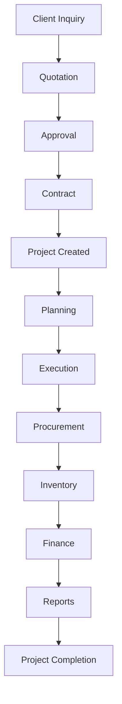

# Creative ERP

Version: 1.0

Document

02_BUSINESS_ANALYSIS

Status

Approved

---

# Purpose

This document defines how a real engineering and construction company operates.

The purpose is to understand business processes before designing the database or writing code.

Software must adapt to business.

Business should never adapt to software.

---

# Business Overview

Creative ERP is designed for project-driven companies.

A company may execute multiple projects simultaneously while sharing resources such as employees, equipment, suppliers, warehouses and financial operations.

Every project is treated as an independent business entity while still belonging to a company.

---

# Business Model

The company earns revenue by completing projects for clients.

Projects consume:

Employees

Materials

Equipment

Time

Money

Documents

Every resource should be traceable.

---

# Company Structure

Company

↓

Branches

↓

Departments

↓

Teams

↓

Employees

---

# Main Departments

Executive Management

Operations

Engineering

Finance

Human Resources

Procurement

Warehouse

Equipment

Administration

Sales & Marketing

IT

Legal

Quality Assurance

Health & Safety

Each department has different permissions.

---

# Core Business Workflow

Client

↓

Project Opportunity

↓

Quotation

↓

Approval

↓

Contract

↓

Project Creation

↓

Planning

↓

Task Assignment

↓

Procurement

↓

Execution

↓

Site Reporting

↓

Inspections

↓

Progress Tracking

↓

Completion

↓

Final Documentation

↓

Invoice

↓

Payment

↓

Project Archive

---

# Business Process 1

Client Acquisition

A client contacts the company.

The sales department records the inquiry.

A quotation is prepared.

The quotation is approved.

The client accepts.

A project is created.

---

Business Rules

Every client must belong to one company.

A client can own multiple projects.

Every quotation belongs to one client.

Every contract belongs to one quotation.

---

# Business Process 2

Project Creation

Project Manager creates project.

Assign Company

Assign Client

Assign Budget

Assign Start Date

Assign End Date

Assign Engineers

Assign Team

Upload Contract

Upload Drawings

Upload BOQ

Generate Project Code

Project becomes Active.

---

Business Rules

Project Code must be unique.

Budget cannot be negative.

Project must belong to one company.

Project status changes must be recorded.

---

# Business Process 3

Planning

Create milestones.

Create work packages.

Create tasks.

Assign engineers.

Assign supervisors.

Assign deadlines.

Estimate costs.

Estimate materials.

Estimate equipment.

---

Business Rules

Every task belongs to one project.

Task must have owner.

Task must have status.

---

# Business Process 4

Procurement

Engineer requests material.

Manager approves.

Procurement requests quotations.

Supplier selected.

Purchase Order created.

Goods delivered.

Warehouse receives goods.

Inventory updated.

Project stock updated.

---

Business Rules

No purchasing without approval.

Stock movements must be recorded.

Supplier history maintained.

---

# Business Process 5

Inventory

Material received.

Material stored.

Material transferred.

Material issued.

Material returned.

Material adjusted.

Material consumed.

Inventory updated.

---

Business Rules

Negative stock not allowed.

Every movement logged.

Barcode support planned.

---

# Business Process 6

Equipment

Equipment registered.

Assigned to project.

Maintenance scheduled.

Fuel tracked.

Repairs recorded.

Returned to warehouse.

---

Business Rules

Equipment cannot belong to two active projects unless shared.

Maintenance history permanent.

---

# Business Process 7

Human Resources

Employee registered.

Department assigned.

Role assigned.

Project assigned.

Attendance recorded.

Leave managed.

Performance reviewed.

Payroll future module.

---

Business Rules

Employee can join multiple projects.

Employee belongs to one company.

---

# Business Process 8

Documents

Upload drawing.

Upload permit.

Upload contract.

Upload invoice.

Upload BOQ.

Upload reports.

Approve document.

Archive old versions.

---

Business Rules

Never overwrite files.

Every upload creates version.

Approval history permanent.

---

# Business Process 9

Finance

Budget created.

Expenses recorded.

Invoices generated.

Payments received.

Cash flow updated.

Reports generated.

---

Business Rules

Expenses linked to project.

Budgets immutable after approval unless revised.

---

# Business Process 10

Communication

Comments

Internal messages

Announcements

Meeting minutes

Notifications

Email

Future

WhatsApp

SMS

Push Notification

---

Business Rules

Messages linked to projects when applicable.

---

# Business Process 11

Reporting

Dashboard

Budget Reports

Inventory Reports

Employee Reports

Equipment Reports

Project Reports

Financial Reports

Executive Reports

---

Reports should support

PDF

Excel

CSV

Scheduled Email

Charts

---

# Cross Module Relationships

Projects

↓

Tasks

↓

Employees

↓

Materials

↓

Inventory

↓

Procurement

↓

Finance

↓

Reports

↓

Dashboard

Everything connects.

---

# Risks

Document loss

Poor communication

Duplicate data

Unauthorized access

Budget overruns

Project delays

Inventory mismatch

Approval delays

Human error

Software downtime

---

# Mitigation

Audit Logs

Permissions

Notifications

Automatic Backups

Approval Workflow

Version Control

Validation

Activity Tracking

---

# Functional Areas

Core

Projects

CRM

HR

Finance

Inventory

Equipment

Communication

Reports

Website CMS

API

Settings

Security

---

# Non Functional Goals

Fast

Secure

Scalable

Reliable

Maintainable

Cloud Ready

Responsive

API Ready

Multi Company

Multi Language

---

# Business Rules

Every record belongs to a company.

Projects own tasks.

Projects own documents.

Projects own reports.

Employees require permissions.

Deleted records should be recoverable where appropriate.

Approvals recorded permanently.

Audit logs cannot be modified.

---

# Success Criteria

Users can complete an entire project lifecycle without leaving the system.

All departments work inside one platform.

Every action is traceable.

Reports generated instantly.

Permissions enforced everywhere.

---

# Mermaid - Overall Business Flow

---

# Conclusion

Creative ERP is designed around real business operations rather than isolated software modules.

Every module must contribute to completing a project's lifecycle efficiently while maintaining complete visibility, accountability, and data integrity.