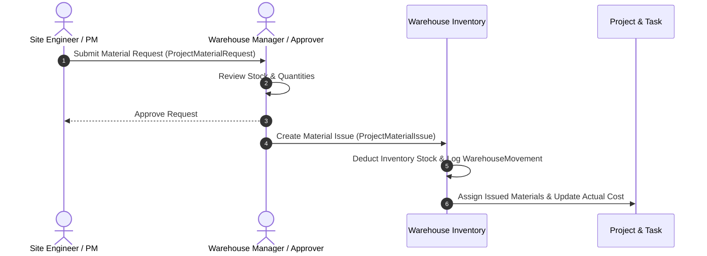
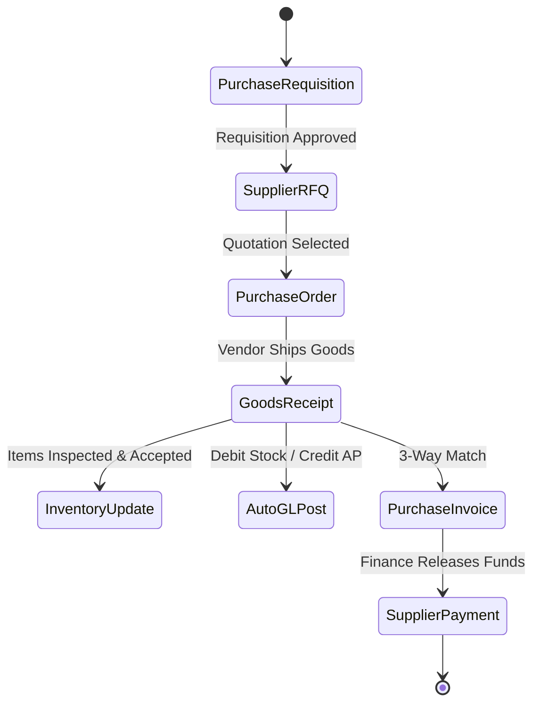

# Creative ERP Business Analysis & Core Processes Specification

**Version**: 1.1  
**Document**: 02_BUSINESS_ANALYSIS  
**Status**: Approved & Updated  

---

# 1. Executive Overview

This document specifies the exact business workflows and operational domain rules governing Creative ERP.

In a contracting and engineering enterprise, business operations revolve around executing client projects while sharing central resources—such as warehouses, employees, equipment, and financial capital.

---

# 2. Main Business Workflows & Operations

## 📦 Business Process A: Site Material Request & Issuance

### Overview
Site engineers require raw materials, components, and tools to execute project tasks.

### Workflow

```mermaid
sequenceDiagram
    autonumber
    actor Engineer as Site Engineer / PM
    actor Approver as Warehouse Manager / Approver
    participant WH as Warehouse Inventory
    participant Proj as Project & Task

    Engineer->>Approver: Submit Material Request (ProjectMaterialRequest)
    Approver->>Approver: Review Stock & Quantities
    Approver-->>Engineer: Approve Request
    Approver->>WH: Create Material Issue (ProjectMaterialIssue)
    WH->>WH: Deduct Inventory Stock & Log WarehouseMovement
    WH->>Proj: Assign Issued Materials & Update Actual Cost
```

### Business Rules
1. **Material Requests**: State transition follows `Draft` $\rightarrow$ `Submitted` $\rightarrow$ `Approved` / `Rejected` $\rightarrow$ `Issued` / `Converted`.
2. **Material Issuance**:
   - MUST select a valid `Warehouse` and `Project` / `Task`.
   - Items issued MUST NOT exceed currently available stock in the specified warehouse.
   - Automatic deduction of stock levels via `InventoryTransaction` and `WarehouseMovement`.
   - Logs `issued_by` user ID and issue timestamp.

---

## 💰 Business Process B: Project Expenses & Labor/Salary Tracking

### Overview
Project financial tracking requires distinguishing between physical direct site expenses and human labor costs.

### Workflow

```mermaid
flowchart LR
    A[Expense Entry Created] --> B{Category Check}
    B -- Direct Expense --> C[Direct Cost Account]
    B -- Worker Salary / Labor --> D[Labor / Payroll Cost Account]
    C --> E[Rollup to Project Actual Cost]
    D --> E
    E --> F[General Ledger Journal Entry]
```

### Business Rules
1. **Expense Classification**:
   - `Labor / Worker Salary`: Categories matching `Worker Salary`, `Labor`, `Payroll`.
   - `Direct Expenses`: Fuel, equipment rental, subcontracts, site utilities, permits, etc.
2. **Project Rollup**: Expenses immediately update `Project::actual_cost` and appear on project financial dashboards.
3. **Receipt Storage**: File uploads stored securely with audit trail of uploader and expense date.

---

## 🛒 Business Process C: Procurement & Goods Receipts (GRN)

### Overview
The purchasing lifecycle bridges site procurement needs with central warehouse receiving and vendor billing.

### Workflow

```mermaid
stateDiagram-v2
    [*] --> PurchaseRequisition
    PurchaseRequisition --> SupplierRFQ: Requisition Approved
    SupplierRFQ --> PurchaseOrder: Quotation Selected
    PurchaseOrder --> GoodsReceipt: Vendor Ships Goods
    GoodsReceipt --> InventoryUpdate: Items Inspected & Accepted
    GoodsReceipt --> AutoGLPost: Debit Stock / Credit AP
    GoodsReceipt --> PurchaseInvoice: 3-Way Match
    PurchaseInvoice --> SupplierPayment: Finance Releases Funds
    SupplierPayment --> [*]
```

### Business Rules
1. **Quotation Comparison**: RFQs support side-by-side comparison matrices of vendor pricing, lead time, and payment terms.
2. **Goods Receipt Inspection**:
   - Quantity received vs. PO quantity is tracked per line item.
   - Stock balance in the designated warehouse is updated immediately.
3. **Automatic GL Posting**: GRN triggers debit to Inventory Asset account and credit to Accounts Payable / Unbilled GRN account.

---

## 🏛️ Business Process D: Financial Accounting & Auto-Posting Engine

### Overview
Creative ERP utilizes a double-entry accounting engine to track balance sheet assets/liabilities and income statement performance.

### Key Financial Concepts
- **Chart of Accounts (COA)**: Hierarchical classification of accounts (Asset, Liability, Equity, Revenue, Expense).
- **Journal Voucher**: Manual or automated double-entry transactions where $\sum Debits = \sum Credits$.
- **Fiscal Periods**: Monthly periods and annual fiscal years.
- **Period Closing**: Closing a period locks all entries against historical editing.

### Automatic System Posting Matrix

| Event | Debit Account | Credit Account |
| :--- | :--- | :--- |
| **Goods Receipt (GRN)** | Inventory Asset Account | Accounts Payable / Accrued PO Liability |
| **Customer Invoice Issued** | Accounts Receivable | Revenue Account / Sales |
| **Customer Payment Received** | Cash / Bank Account | Accounts Receivable |
| **Supplier Payment Released** | Accounts Payable | Cash / Bank Account |
| **Asset Depreciation** | Depreciation Expense | Accumulated Depreciation |

---

## 🚜 Business Process E: Fixed Asset Lifecycle Management

### Overview
Track heavy machinery, trucks, equipment, and office hardware across their complete life cycle.

### Lifecycle Steps
1. **Registration**: Record asset code, serial number, purchase cost, acquisition date, vendor, and warranty.
2. **Depreciation Schedule**: Straight Line or Declining Balance calculations.
3. **Maintenance & Repairs**: Log preventative maintenance, parts consumed, and repair costs.
4. **Site Transfer**: Transfer assets between branches, warehouses, or project sites with approval logging.
5. **Disposal**: Asset retirement, sale, or scrap with gain/loss on disposal GL calculation.

---

## 🏭 Business Process F: Advanced Warehouse Management (WMS)

### Overview
Optimizes physical storage layout and warehouse operations.

### Key Operations
- **Warehouse Architecture**: Warehouse $\rightarrow$ Zones $\rightarrow$ Bins.
- **Put-Away Tasks**: Guiding warehouse operators to store received goods in designated bin locations.
- **Picking & Packing**: Generating picking routes for outgoing site shipments or material issues.
- **Cycle Counts**: Periodic inventory counting with adjustment approvals for stock discrepancies.