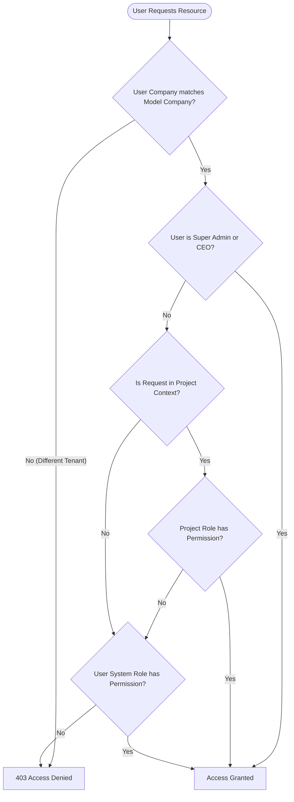

# Creative ERP Authentication & Authorization Architecture

**Version**: 1.1  
**Document**: 03_AUTHENTICATION  
**Status**: Approved & Updated  

---

# 1. Executive Summary

Creative ERP enforces a dual-layered security architecture:
1. **Authentication Layer**: Verifies user identity for web sessions (Blade UI) and stateless tokens (REST API).
2. **Authorization & Access Control Layer**: Enforces dynamic Role-Based Access Control (RBAC) via Spatie Laravel Permission, project-specific role overrides, and multi-tenant company isolation.

---

# 2. Authentication Mechanisms

## A. Web Authentication (Blade UI)
- **Guard**: Standard Web Session Guard (`auth`).
- **Middleware Chain**: `auth` $\rightarrow$ `check.status` $\rightarrow$ `track.activity` $\rightarrow$ `ensure.role`.
- **Features**:
  - Email & Password authentication.
  - User Status Enforcement (`Active`, `Inactive`, `Suspended`, `Locked`, `Pending Verification`). Only `Active` users can access protected admin routes.
  - Password Reset via email signed tokens.
  - Password Change with current password validation.
  - Remember Me persistent cookie support.
  - Login History logging (`LoginHistory` model capturing IP, User Agent, and timestamp).

## B. REST API Authentication (Sanctum)
- **Guard**: Laravel Sanctum (`auth:sanctum`).
- **Token Type**: Bearer Tokens issued via `/api/login`.
- **Endpoints**:
  - `POST /api/login`: Authenticates credentials and returns Sanctum Bearer Token.
  - `POST /api/logout`: Revokes current API token.
  - `GET /api/me`: Returns authenticated user profile, assigned company, and roles.

---

# 3. Dynamic Authorization & RBAC System

Creative ERP utilizes Spatie Laravel Permission for global role and permission management, supplemented by custom project-level role evaluations.



---

# 4. Project-Level Permission Evaluation

In contracting projects, a user may be a global `Engineer` in the system, but assigned as `Project Manager` on Project A and `Site Inspector` on Project B.

To support this dynamic scoping, `App\Models\Project` provides the method:

```php
public function hasPermissionForUser(?User $user, string $permission): bool
```

### Evaluation Hierarchy:
1. **Tenant Isolation**: Verifies `$user->company_id === $project->company_id`.
2. **Super Administrator Exemption**: Users with `Super Admin` or `CEO` roles automatically pass all checks.
3. **Project Manager Check**: If `$project->project_manager_id === $user->id`, user gains `Project Manager` role capabilities.
4. **Assigned Project Role Check**: Resolves the user's role on the project via `project_members` pivot table (`$member->project_role`). Checks if that specific Spatie role possesses the requested permission.
5. **Global Fallback**: If no project role permission matches, evaluates `$user->hasPermissionTo($permission)`.

---

# 5. Multi-Company Tenancy Scoping

Every core entity (Projects, Material Issues, Expenses, Invoices, Goods Receipts, Warehouses, Accounts) belongs to a `company_id`.

- **`CompanyScoped` Trait**: Automatically applies an Eloquent global scope (`where company_id = auth()->user()->company_id`) to prevent cross-company data leakage.
- **Super Admin Bypass**: Super Admins can switch company views or inspect global datasets.

---

# 6. Default Roles & Permissions Matrix

| Role Name | System Capabilities | Project Access Scope |
| :--- | :--- | :--- |
| **Super Admin** | Full global access to all companies, settings, CMS, and configurations. | Global All |
| **Company Admin** | Full management within assigned company (Users, Projects, Accounting, Procurement). | Company Wide |
| **Project Manager** | Manages assigned projects, milestones, tasks, team, expenses, and material requests. | Assigned Projects |
| **Site Engineer** | Creates material requests, submits daily logs, manages site tasks, and logs time entries. | Assigned Projects |
| **Warehouse Manager** | Manages stock, warehouses, bins, material issuances, goods receipts, and cycle counts. | Warehouse & Inventory |
| **Procurement Manager** | Manages suppliers, RFQs, purchase orders, goods receipt approvals, and purchase invoices. | Procurement Module |
| **Accountant** | Manages Chart of Accounts, journal vouchers, customer invoicing, payments, and financial reports. | Finance Module |