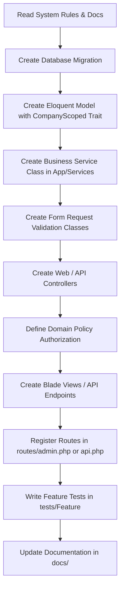

# Creative ERP Project Setup & Architecture Standards

**Version**: 1.1  
**Document**: 04_PROJECT_SETUP  
**Status**: Approved & Updated  

---

# 1. System Requirements & Environment

### Prerequisites
- **PHP**: 8.4 or higher
- **Composer**: 2.6+
- **Node.js**: 18.x or higher
- **MySQL**: 8.0+
- **Database Storage Engine**: InnoDB (UTF8MB4)

---

# 2. Complete Local Installation Guide

```bash
# 1. Clone the repository
git clone https://github.com/Mubarakizere/creative-erp.git
cd creative-erp

# 2. Install PHP Dependencies
composer install

# 3. Install Node Dependencies
npm install

# 4. Copy Environment File & Generate App Key
cp .env.example .env
php artisan key:generate

# 5. Configure Database Credentials in .env
# Edit .env file with appropriate DB_DATABASE, DB_USERNAME, DB_PASSWORD

# 6. Run Database Migrations & Seeders
php artisan migrate --seed

# 7. Create Storage Link
php artisan storage:link

# 8. Start Local Development Environment
npm run dev           # Terminal 1: Vite Compiler
php artisan serve     # Terminal 2: Laravel Server
php artisan queue:work # Terminal 3: Queue Worker
```

---

# 3. Project Directory Architecture

```
creative-erp/
├── app/
│   ├── Http/
│   │   ├── Controllers/
│   │   │   ├── Admin/             # Web Blade Controllers
│   │   │   ├── API/               # REST API Controllers
│   │   │   ├── Dashboard/         # Dashboard & KPI Controllers
│   │   │   └── Finance/           # Accounting & Report Controllers
│   │   ├── Middleware/            # Custom Auth & Scoping Middleware
│   │   ├── Requests/              # Dedicated Form Request Validation
│   │   └── Resources/             # API JSON Resources
│   ├── Models/                    # Eloquent Models (120+ entities)
│   │   └── Traits/                # CompanyScoped, HasUuidColumn, etc.
│   ├── Policies/                  # Domain Policies
│   ├── Services/                  # Business Logic Layer
│   └── Traits/                    # System & Logging Traits
├── database/
│   ├── factories/                 # Eloquent Model Factories
│   ├── migrations/                # Database Schema Migrations
│   └── seeders/                   # Database Seeders & Permission Setup
├── docs/                          # System Specifications & Release Notes
├── resources/
│   ├── css/                       # Custom Tailwind Styles & CSS
│   ├── js/                        # Alpine.js Components & Axios Setup
│   └── views/                     # Blade Layouts & Domain Components
│       ├── admin/                 # Admin Panel Views
│       ├── components/            # Reusable UI Elements
│       └── layouts/               # Master App Layouts
├── routes/
│   ├── admin.php                  # Web Admin Panel Routes
│   ├── api.php                    # REST API Routes
│   ├── auth.php                   # Web Auth Routes
│   └── web.php                    # Public & Landing Routes
└── tests/                         # Feature & Unit Test Suites
```

---

# 4. Core Development Workflow

When implementing or extending any module in Creative ERP, follow this step-by-step pipeline:

